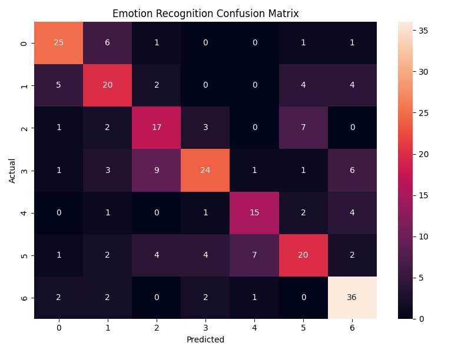
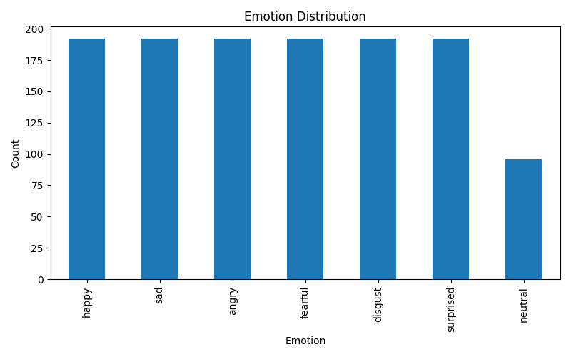
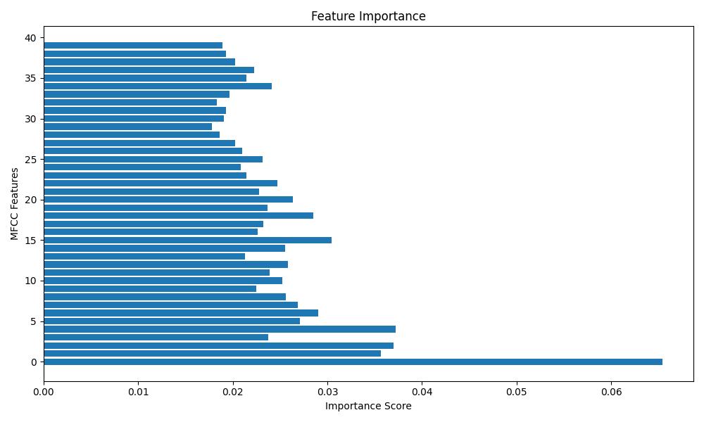

# Speech Emotion Recognition Using Machine Learning

## Overview

This project is a Speech Emotion Recognition (SER) system developed using Machine Learning and the RAVDESS Emotional Speech Dataset. The model analyzes speech audio files and predicts the emotional state expressed by the speaker.

The objective of this project is to automatically recognize human emotions from voice recordings using audio feature extraction and classification techniques.

---

## Dataset

### RAVDESS Emotional Speech Audio Dataset

The Ryerson Audio-Visual Database of Emotional Speech and Song (RAVDESS) is a widely used dataset for emotion recognition research.

### Dataset Details

- Total Audio Samples Used: **1248**
- Audio Format: **WAV**
- Sampling Rate: **48 kHz**
- Actors: **24 Professional Actors**
- Language: **English**

### Emotions Detected

| Emotion Code | Emotion |
|-------------|----------|
| 01 | Neutral |
| 03 | Happy |
| 04 | Sad |
| 05 | Angry |
| 06 | Fearful |
| 07 | Disgust |
| 08 | Surprised |

---

## Features Extracted

The model uses **MFCC (Mel Frequency Cepstral Coefficients)** extracted from audio signals.

MFCC features are widely used in speech processing because they effectively represent the characteristics of human speech.

### Feature Extraction Method

- Audio Loading using Librosa
- Noise Reduction through audio trimming
- MFCC Extraction
- Feature Averaging
- Feature Vector Creation

---

## Machine Learning Algorithm

### Random Forest Classifier

The Random Forest algorithm was selected because:

- High classification performance
- Handles multi-class classification effectively
- Less prone to overfitting
- Works well with extracted MFCC features

### Model Parameters

```python
RandomForestClassifier(
    n_estimators=200,
    random_state=42
)
```

---

## Project Workflow

### 1. Data Collection

Load all audio files from the RAVDESS dataset.

### 2. Emotion Label Extraction

Extract emotion labels from the audio file names.

### 3. Audio Feature Extraction

Extract MFCC features using Librosa.

### 4. Dataset Preparation

Convert extracted features into training data.

### 5. Train-Test Split

Split dataset into:

- Training Set: 80%
- Testing Set: 20%

### 6. Model Training

Train Random Forest Classifier using extracted MFCC features.

### 7. Model Evaluation

Evaluate model using:

- Accuracy Score
- Classification Report
- Confusion Matrix

### 8. Model Saving

Save trained model using Joblib.

---

## Model Performance

### Test Accuracy

**60.00%**

### Cross Validation Accuracy

**40.94% (5-Fold Cross Validation)**

### Execution Time

**11.29 Seconds**

### Classification Report

| Emotion | Precision | Recall | F1-Score |
|----------|-----------|---------|-----------|
| Angry | 0.71 | 0.66 | 0.68 |
| Disgust | 0.51 | 0.55 | 0.53 |
| Fearful | 0.63 | 0.62 | 0.62 |
| Happy | 0.58 | 0.46 | 0.51 |
| Neutral | 0.73 | 0.58 | 0.65 |
| Sad | 0.55 | 0.56 | 0.56 |
| Surprised | 0.58 | 0.76 | 0.66 |

---

## Confusion Matrix

The confusion matrix provides a detailed breakdown of model predictions across all emotion classes.



---

## Emotion Distribution

The following graph shows the distribution of emotion samples present in the dataset.



---

## Feature Importance

The graph below shows the relative importance of extracted MFCC features used by the Random Forest classifier.



## Generated Files

| File | Description |
|--------|-------------|
| emotion_recognition.py | Main project source code |
| emotion_model.pkl | Trained Random Forest model |
| results.txt | Classification report and dataset statistics |
| confusion_matrix.png | Confusion matrix visualization |
| emotion_distribution.png | Dataset emotion distribution graph |
| feature_importance.png | Feature importance visualization |
| feature_importance.csv | Feature importance ranking |
| README.md | Project documentation |
| requirements.txt | Required Python libraries |


---

## Installation

### Clone Repository

```bash
git clone https://github.com/anubhabpal1805/CodeAlpha_EmotionRecognition.git
```

### Navigate to Project Folder

```bash
cd EmotionRecognition
```

### Install Dependencies

```bash
pip install -r requirements.txt
```

---

## Running the Project

Execute the following command:

```bash
python emotion_recognition.py
```

### Expected Output

```text
Loading audio files...
Dataset Loaded Successfully
Samples: 1248

Cross Validation Accuracy: 40.94%

========== MODEL RESULTS ==========
Accuracy: 60.00%

Results saved successfully!
Model saved successfully!
Feature importance CSV saved!
Confusion matrix saved!
Emotion distribution graph saved!
Feature importance graph saved!

Execution Time: 11.29 seconds

Project executed successfully!
```

---

## Technologies Used

- Python
- NumPy
- Pandas
- Librosa
- Scikit-Learn
- Joblib
- Matplotlib
- Seaborn

---

## Future Improvements

- Deep Learning using CNNs
- LSTM-based Speech Emotion Recognition
- Real-Time Emotion Prediction
- Speech-to-Text Integration
- Web Application Deployment using Flask


---

## Key Achievements

- Processed 1248 speech recordings from the RAVDESS dataset
- Extracted 40 MFCC features from every audio sample
- Classified 7 distinct human emotions
- Achieved 60.00% test accuracy
- Achieved 40.94% cross-validation accuracy
- Generated confusion matrix and emotion distribution visualizations
- Generated feature importance analysis
- Saved trained model for future emotion prediction
- Implemented modular function-based code structure
- Produced automated reports and visualizations

## Project Highlights

- Speech Emotion Recognition using Machine Learning
- MFCC Feature Extraction using Librosa
- Random Forest Classification
- Cross Validation Evaluation
- Automated Result Generation
- Data Visualization using Matplotlib and Seaborn
- Model Persistence using Joblib
- Professional GitHub Project Structure

## Author

### Anubhab Pal

Machine Learning Intern — CodeAlpha

---

## License

This project is developed for educational and internship purposes under the CodeAlpha Machine Learning Internship Program.
